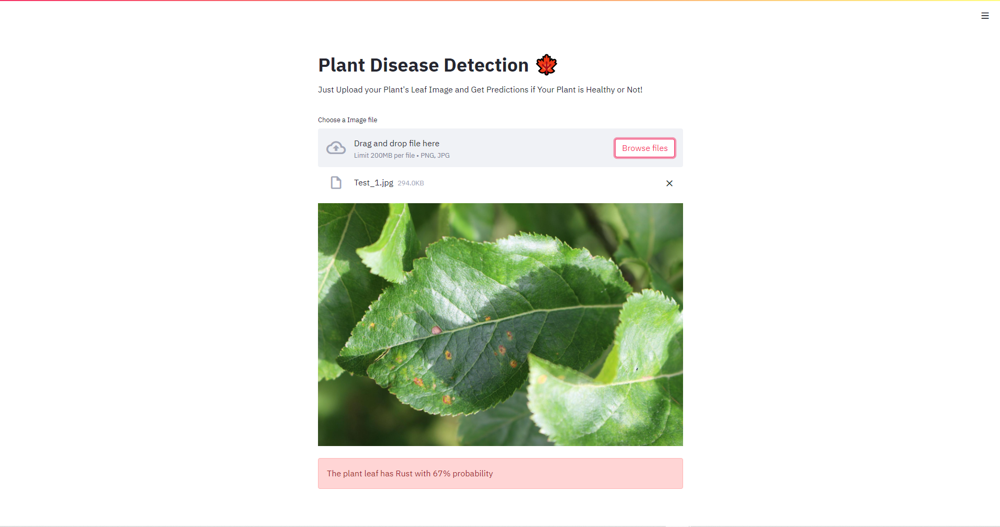

# Plant Leaf Classifcation 🍁

Final project for the [Complete Deep Learning and Computer Vision Course](https://www.udemy.com/course/dlcourse/?referralCode=1B0F4190621EDAD897D1)

## Summary

In this project, we made a Web Application that allows us to take a plant leaf image and then predict if the leaf/plant is healthy or has diseases like rust, scab, or multiple disease. We use a Deep Learning Learning which takes in leaf image and gives the predictions. 

## Background

Having diseases in plants or crops is not good 😅 and detecting what kind of disease it is can really help to make right decisions to remove/prevent the disease. And Deep Learning can really helps in detection all kinds of plant diesease very accuratly and can be runned right on webpage or even mobile phones. 

## How is it used?

It is really easy to use. Just go to [this](our link) link. And upload your plant leaf image. After uploading the image, the process will automatically start where the deep learning model will take the image and after a few seconds, predictions will be shown!

## Getting Started
For people who want to improve/make changes to the projects :)

### Libraries used
- [Tensorflow 2.0](http://tensorflow.org/) - Framewrok for creating & training deep learning models 
- [efficientnet](https://github.com/qubvel/efficientnet) - Libraries for training efficient-net model architectures 
- [Streamlit](https://streamlit.io/) - For creating Web Applications using python 
- [Wandb](https://wandb.ai/) - For Recording our Experiments 

### Prerequisites

The code has only been tested on Python 3.7.7 so it's recommended

* [Python 3.x](https://www.python.org/) - You can download python in Official Python Site.

### Installation

1. Clone the repo by running `git clone https://github.com/Shubhamai/plant-leaf-classification` in terminal. 
2. run `pip install -r requirements.txt`
3. Run `streamlit run app.py`
4. Enjoy 🎊

## Data sources and AI methods

The dataset was from [Plant Pathology 2020 - FGVC7 Kaggle Competition](https://www.kaggle.com/c/plant-pathology-2020-fgvc7). This Dataset had over **1821 training images** and **1821 testing images**. There were 4 different classes in the dataset - healthy, multiple diseases, rust & scab. 
 

We used Tensorflow 2.0 for creating & training deep learning models and weights & biases for recording our experimentations. You can find all of our experiments recorded from [here](https://wandb.ai/shubhamai/plant%20disease%20classification/reports/Plant-Disease-Detection--VmlldzoyNjMzNTA).   

## Challenges

The dataset we use only had 4 different classes and was only for apple trees. It would be much better to have more variety in the dataset with many different kinds of leaf images from different kinds of trees. 

## What next?

As said in the challenges section, to improve on this project we need to have more variety in the dataset. 

## Acknowledgments

* This project was developed from the [Complete Deep Learning and Computer Vision Course](https://www.udemy.com/course/dlcourse/?referralCode=1B0F4190621EDAD897D1) by [Shubhamai](https://shubhamai.com)
